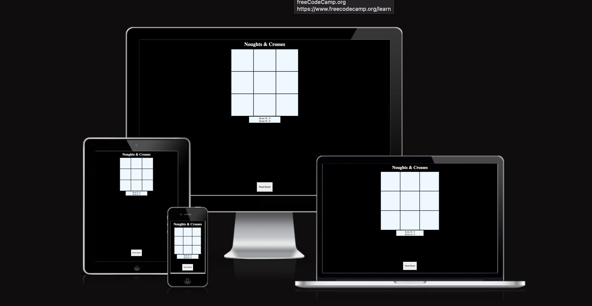
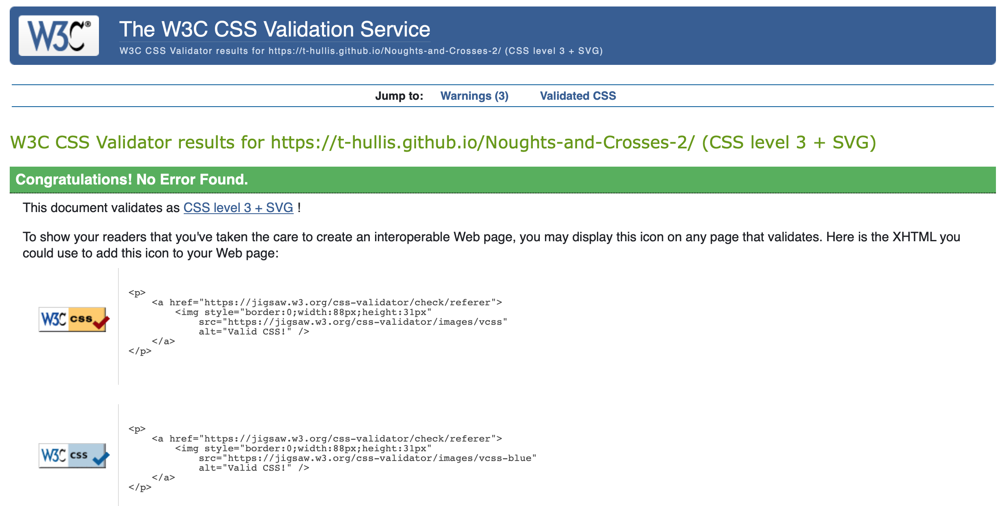
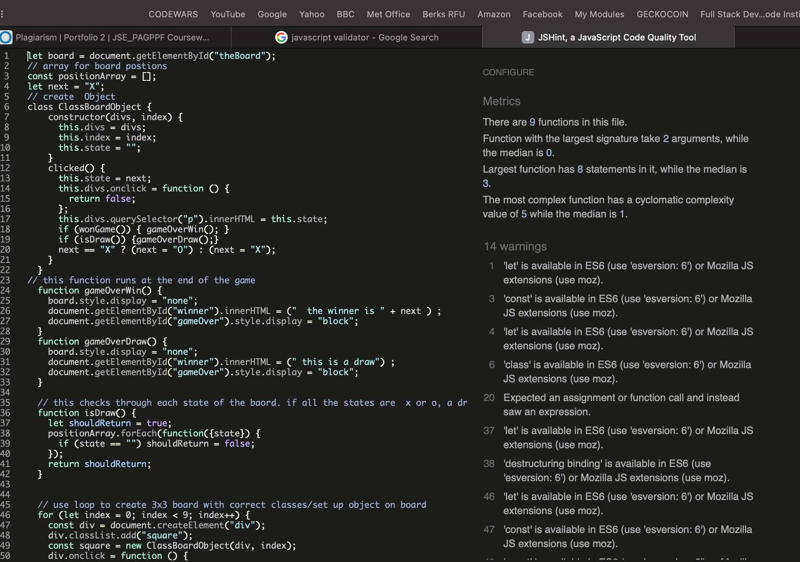

# Noughts and Crosses
Noughts and crosses is a classic board game where each player places a letter (X or O). the agme is won by scoring three in a row of the same letter. The programme can tell if you have placed a winning combination and will tell the winner that they have won. 

I had two attempts to make this game as i wanted to mostly use javascript to get practice and limit the amount of html and css used. The first game i made, quickly started to use too much html, so i started again with the intention of using javascript to make the html. To find my first attempt, look at my github account and look for the repository called Noughts and crosses.

## UX/UI
### Title
the title is very simple so as not to distract from the game. It makes it clear what the game is.

### Board
Each tile on the board has its own click function embeded in it. This keeps the board looking clean.
Once the tile has been clicked, it displays the letter (X or Y) and then it cannot be clicked again. The board is then hidden after the game is over, to avoid more goes being played.

### ScoreBoard
This displays the scores of the X and O player. When a player wins, one point is added to their score. If its a draw, neither player gets a point.

### Reset Button
This button has been posistioned absoultly so it does not move and is always available to be clicked.

### Game Over page
This has been created to cover the board and score board, whilst dipslaying the winner of the game. the title of the page is displayed in large too.

## Features
This is a fully interactive game. Every click on a tile will place the letter of the current player. The game will automaticlly switch between nought and cross on each go and tell you the winner.

### Main Board
The board is made using mostly javascript with only a couple lines of html. I used loops to create divs and added some css styling to create the format of the board. The individual tiles are made to be clicked on but only once, and then they display the letter of the player that clicked.

I then used functions (if statments) to decide who the winner was, if there was one, and to declare a draw if there wasnt. This message is displayed after the board has disapeared.

### ScoreBoard
One is added to the score of the winner of the game. This has been added within the gamewon function.

### Reset Button
The reset button was made so the game can be played for multiple rounds without needing to refresh the page. The button works by wiping the possition array back to its original state (empty). It also removes the innerHTML from each tile.

### Features left to depoly

In the future i would like to make a feature where you can play against the computer or even an A.I.

### Testing

Passed HTML

Passed CSS

Passed Javascript

## Deployment
The site was deployed to GitHub pages. The steps to deploy are as follows:
- In the GitHub repository, navigate to the Settings tab
- From the source section drop-down menu, select the Master Branch
- Once the master branch has been selected, the page will be automatically refreshed with a detailed ribbon display to indicate the successful deployment.

Live link https://t-hullis.github.io/Noughts-and-Crosses-2/

## Credits
The basic design for my winner function was inspired by what i saw online as all the function are very similar. https://www.youtube.com/watch?v=oZrp3Atkz18 i used this video to help me in perticular.

