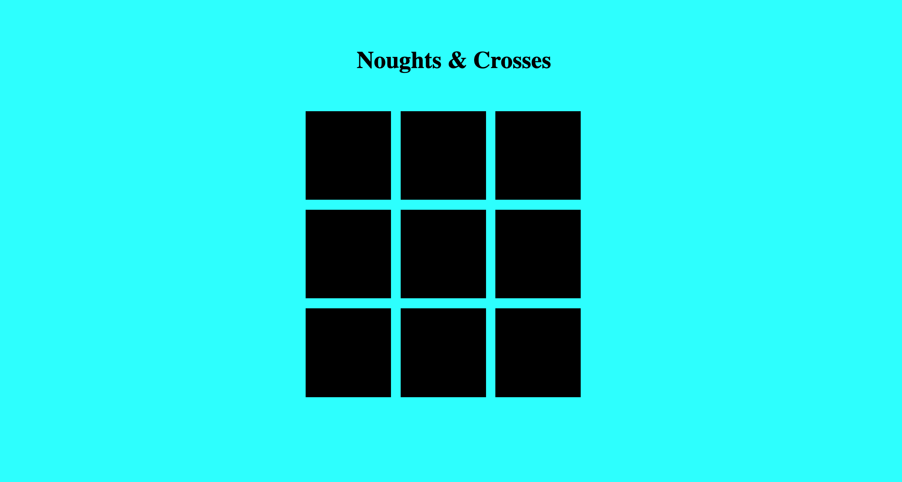
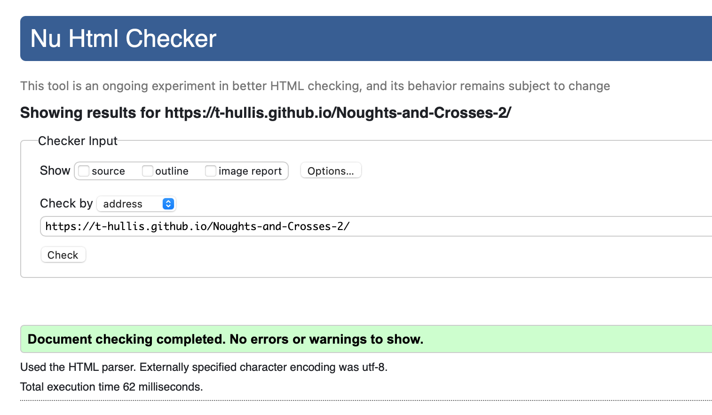

# Noughts and Crosses
Noughts and crosses is a classic board game where each player places their letter and you win by scoring three in a row of the same letter. The game can tell if you have done a winning combination and will tell the winner that they have won. 

I had two attempts to make this game as i wanted to mostly use javascript to get some practice and limit the amount of html and css i used. The first game i made, quickly started to use too much html, so i started again with the intention of using javascript to make the html. To find my first attempt, look at my github account and look for the repository called Noughts and crosses.

## Features
This is a fully interactive game. Every click on a tile will place the letter of the current player. The game will automaticlly switch between nought and cross on each go and tell you the winner.

### Title
the title is very simple so as not to distract from the game. It makes it clear what the game is.

### Main Board
The board is made using mostly javascript with only a couple lines of html. I used loops to create divs and added some css styling to create the format of the board. The individual tiles are made to be clicked on but only once, and then they display the letter of the player that clicked.

I then used functions (if statments) to decide who the winner was, if there was one, and to declare a draw if there wasnt. This message is displayed after the board has disapeared.

### Features left to depoly

If i had more time id like to have made a score counter and a reset button. Also, in the future i would like to make a feature where you can play against the computer

### Testing

Passed HTML

Passed CSS

Passed Javascript

